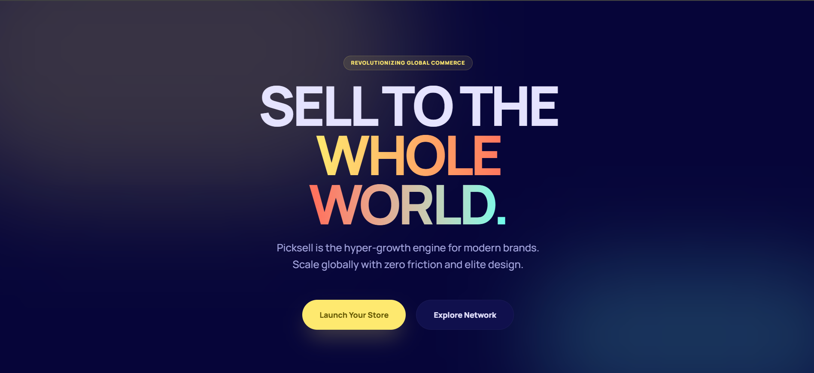
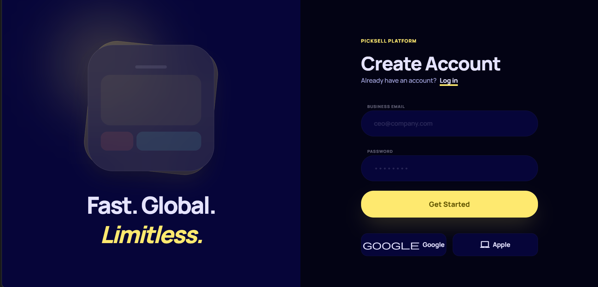
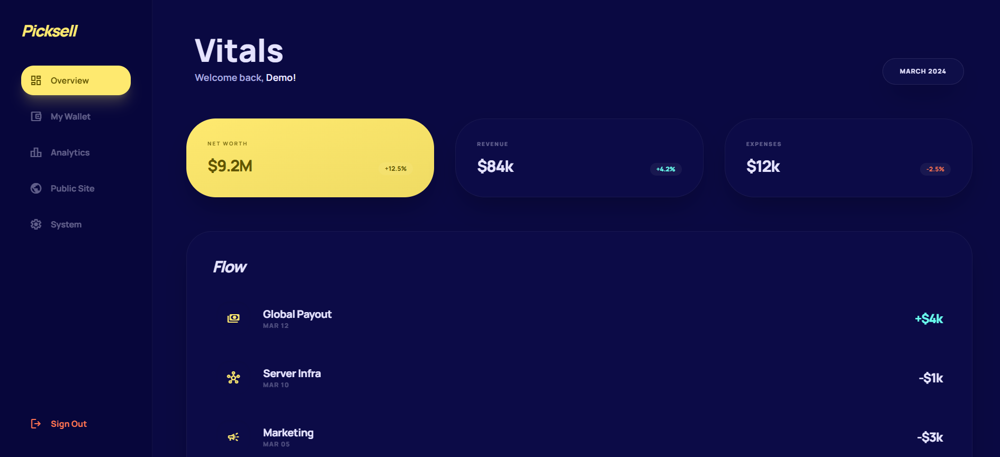

# 📦 Picksell - Global Selling Platform

Picksell is a high-fidelity, premium global selling platform designed for modern brands. It features a cinematic user experience, advanced design language, and an extremely concise codebase.

## ✨ Key Features
- **Cinematic Landing Page**: Global commerce hero section with vibrant mesh gradients.
- **Premium Auth Portal**: High-fidelity, split-screen layout with Google Authentication.
- **Financial Dashboard**: Bento-style stats, dynamic vitals, and transaction flow tracking.
- **Next-Gen Stack**: Built with **React** and **Tailwind CSS v4** for maximum performance.
- **Bulletproof Resiliency**: Fallback mechanisms for offline/missing configuration states.

---

## 📸 Webpages Preview

### 1. Landing Page
*Global scale commerce with elite design.*


### 2. Authentication Portal
*Secure access with high-fidelity visuals.*


### 3. Financial Dashboard
*Real-time business vitals and transaction tracking.*


---

## 🛠️ Setup & Installation

### 1. Clone the repo
```bash
git clone https://github.com/siddharth-1118/ahu.git
cd ahu
```

### 2. Install dependencies
```bash
npm install
```

### 3. Environment Variables
Create a `.env` file in the root and add your Google Client ID:
```env
VITE_GOOGLE_CLIENT_ID=your_google_client_id
```

### 4. Run locally
```bash
npm run dev
```

---

## 🚀 Deployment (Vercel)
When deploying to Vercel, ensure you:
1. Set the **VITE_GOOGLE_CLIENT_ID** environment variable.
2. Add your deployment URL to the **Authorized JavaScript origins** in Google Cloud Console.

---

## 🎨 Design Language
- **Colors**: Picksell Palette (Primary: #00E5FF, Dark Surface)
- **Typography**: Manrope (Bold/Black weight)
- **Styles**: Mesh Gradients, Glassmorphism, 3D Layers
